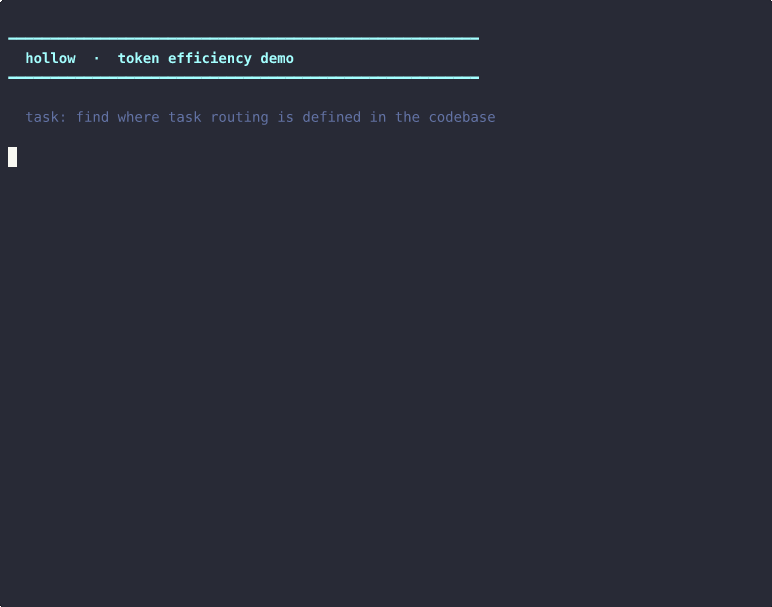

```
 _  _  ___  _    _    _____      __
| || |/ _ \| |  | |  / _ \ \    / /
| __ | (_) | |__| |_| (_) \ \/\/ /
|_||_|\___/|____|____\___/ \_/\_/
```

<div align="center">

**An open-source agent OS that cuts token usage by 68.5%. Built for agents, not humans.**

[](https://github.com/ninjahawk/hollow-agentOS/releases)
[](LICENSE)
[](https://python.org)
[](#setup)

</div>

---

> Current operating systems were designed for humans. Every time an agent touches one, it pays the price — parsing `df -h` output, grepping through files to re-discover what it already knew, running five commands to answer a question that should take one. **Hollow eliminates all of it.**

Hollow is a structured JSON-native operating environment for AI agents. It exposes the system through a single REST API, routes tasks to the right local model automatically, isolates each agent in its own identity and workspace, and passes full session context between agent invocations so nothing is ever re-discovered from scratch.

Benchmarked at **68.5% token reduction** against naive shell-based approaches across five real scenarios.

---

## What Hollow provides

### Identity & Isolation

Every agent that touches Hollow is a first-class process — registered with its own token, its own capability set, and its own isolated workspace directory. A `readonly` agent cannot shell. A `worker` agent cannot spawn children. Capabilities are enforced at the API layer, not by convention.

```
POST /agents/register  →  { agent_id, token, workspace_dir, capabilities }
```

Agents operate within `/workspace/agents/<id>/` by default. The scheduler decides which model handles a task. Agents don't pick.

### Task Scheduler

Submit a task with a complexity hint. Hollow routes it to the right local Ollama model automatically — no model selection logic in your agent code.

| Complexity | Routes to | Model |
|---|---|---|
| 1–2 | `general` | mistral-nemo:12b |
| 3–4 | `code` | qwen2.5:14b |
| 5 | `reasoning` | qwen3.5-35b-moe |

```
POST /tasks/submit  →  { task_id, status, result, ms }
```

### Inter-Agent Messaging

Agents communicate through a typed message bus with inbox queues, reply threads, TTL, and broadcast support. No shared global state — each agent reads its own inbox.

```
POST /messages          →  send { to_id, content, msg_type }
GET  /messages          →  receive inbox (unread, with stats)
GET  /messages/thread   →  full reply thread for a message
```

### Structured State

One call replaces nine. `GET /state` returns disk (Windows + WSL), memory, GPU, services, Ollama status, semantic index health, token totals, and recent actions — all structured JSON, no parsing.

`GET /state/diff?since=<iso>` returns only what changed. Polling agents use this and pay 57% fewer tokens per tick.

### Semantic Search

Natural language search over the entire workspace using [nomic-embed-text](https://ollama.com/library/nomic-embed-text) embeddings and cosine similarity. AST-aware Python chunking — one chunk per function, not per file. Finds the right implementation, not just the right filename.

```
POST /semantic/search  →  top-k chunks with scores and file locations
POST /fs/read_context  →  file content + semantically related neighbors (1 call)
```

### Session Continuity

An agent that finishes writes a structured handoff. The next agent calls `GET /agent/pickup` and gets everything — what was in progress, decisions made, relevant files, next steps, and all actions taken since the handoff was written. Cold-start re-discovery costs 83% fewer tokens with a handoff than without.

---

## See it live



Two real tasks. Both approaches execute against your live system. Token counts are measured, not estimated.

Run it yourself:

```bash
python3 /agentOS/tools/token_demo.py
```

---

## Benchmarks

Measured against a capable agent using raw shell commands on the same system.

| Scenario | Naive | Hollow | Savings |
|---|---|---|---|
| Semantic search vs grep + cat whole file | 3,636 tok | 327 tok | **91%** |
| Agent pickup vs cold log parsing | 14,130 tok | 2,452 tok | **83%** |
| State polling vs 4 shell commands | 1,913 tok | 810 tok | **58%** |
| System state vs 9 discovery commands | 2,377 tok | 1,122 tok | **53%** |
| File + context vs cat 3 full files | 12,632 tok | 6,202 tok | **51%** |
| **Total** | **34,688 tok** | **10,913 tok** | **68.5%** |

Run the full benchmark: `python3 /agentOS/tools/bench_compare.py`

Run integration tests (hits the live API, no mocks): `python3 /agentOS/tools/test_integration.py`

---

## Architecture

```
hollow-agentOS/
├── api/
│   ├── server.py          # FastAPI — all endpoints (v0.4.0)
│   └── agent_routes.py    # Agent OS routes: register, spawn, message, tasks
├── agents/
│   ├── registry.py        # Identity, capabilities, workspaces, budgets
│   ├── bus.py             # Inter-agent message bus
│   └── scheduler.py       # Task routing and agent spawning
├── mcp/
│   └── server.py          # 35 MCP tools for Claude Code and compatible agents
├── memory/
│   └── manager.py         # Session log, workspace map, token tracking, handoffs
├── tools/
│   ├── semantic.py        # AST-aware chunker + embedding search
│   ├── token_demo.py      # 30-second live token efficiency demo
│   ├── bench_compare.py   # Head-to-head token benchmark (3 scenarios)
│   ├── benchmark.py       # Token efficiency benchmark suite
│   └── test_integration.py # 58 live API integration tests (0 mocks)
├── shell/
│   └── agent_shell.py     # JSON-native shell, deadlock-safe
├── dashboard/
│   └── index.html         # Live dashboard (nginx :7778)
└── config.json            # Config (see config.example.json)
```

---

## Agent Roles

| Role | Shell | FS Read | FS Write | Ollama | Spawn | Message |
|---|:---:|:---:|:---:|:---:|:---:|:---:|
| `root` | ✓ | ✓ | ✓ | ✓ | ✓ | ✓ |
| `orchestrator` | ✓ | ✓ | ✓ | ✓ | ✓ | ✓ |
| `worker` | ✓ | ✓ | ✓ | ✓ | — | ✓ |
| `coder` | ✓ | ✓ | ✓ | ✓ | — | ✓ |
| `reasoner` | — | ✓ | — | ✓ | — | ✓ |
| `readonly` | — | ✓ | — | — | — | ✓ |

Custom capability sets are supported at registration.

---

## API Reference

<details>
<summary><strong>Agent OS</strong></summary>

```
POST   /agents/register          Register a new agent (returns token, shown once)
GET    /agents                   List all agents (admin)
GET    /agents/{id}              Get agent state, usage, and budget
DELETE /agents/{id}              Terminate agent
POST   /agents/spawn             Spawn child agent, run task, return result
POST   /agents/{id}/suspend      Suspend agent
POST   /agents/{id}/resume       Resume agent

POST   /messages                 Send message to agent or broadcast
GET    /messages                 Receive inbox (unread by default)
GET    /messages/thread/{id}     Get full reply thread

POST   /tasks/submit             Submit task → scheduler routes to model
GET    /tasks/{id}               Get task result
GET    /tasks                    List tasks
```

</details>

<details>
<summary><strong>System & Shell</strong></summary>

```
GET    /state                    Full system snapshot (JSON)
GET    /state/diff?since=<iso>   Changed fields only since timestamp
GET    /health

POST   /shell                    Run command (scoped to agent workspace)
```

</details>

<details>
<summary><strong>Filesystem</strong></summary>

```
GET    /fs/list                  Directory listing
GET    /fs/read                  Read file
POST   /fs/write                 Write file
POST   /fs/batch-read            Read multiple files in one call
GET    /fs/search                Find files by pattern
POST   /fs/read_context          File + semantically related neighbors
```

</details>

<details>
<summary><strong>Ollama / Semantic</strong></summary>

```
POST   /ollama/chat              Role-based model routing
POST   /ollama/generate          Raw generate
GET    /ollama/models            Available + running + routing table

POST   /semantic/search          Cosine similarity search over workspace
POST   /semantic/index           Re-index workspace
GET    /semantic/stats

POST   /agent/handoff            Write structured session context
GET    /agent/pickup             Handoff + changes since
```

</details>

---

## Setup

**Requirements:** Python 3.12+, [Ollama](https://ollama.com), WSL2 or Linux

```bash
git clone https://github.com/ninjahawk/hollow-agentOS
cd hollow-agentOS

cp config.example.json config.json
# Set: api.token, workspace.root, ollama.host

pip install fastapi uvicorn httpx mcp
```

**Pull required models:**

```bash
ollama pull nomic-embed-text   # semantic search
ollama pull mistral-nemo:12b   # general tasks
ollama pull qwen2.5:14b        # code tasks
```

**Start the API:**

```bash
cd api && python3 -m uvicorn server:app --host 0.0.0.0 --port 7777
```

**Register your first agent:**

```bash
curl -X POST http://localhost:7777/agents/register \
  -H "Authorization: Bearer <master-token>" \
  -H "Content-Type: application/json" \
  -d '{"name": "my-agent", "role": "worker"}'
```

**Wire into Claude Code (MCP):**

Add to `~/.claude/settings.json`:
```json
{
  "mcpServers": {
    "agentos": {
      "command": "python3",
      "args": ["/path/to/hollow-agentOS/mcp/server.py"]
    }
  }
}
```

**Build index:**

```bash
PYTHONPATH=/path/to/hollow-agentOS python3 tools/semantic.py index
```

---

## Services (systemd)

| Service | Port | Description |
|---|---|---|
| `agentos-api` | 7777 | REST API |
| `nginx` | 7778 | Dashboard |
| `ollama` | 11434 | Local inference |
| `agentos-indexer.timer` | — | Re-index every 30s |

```bash
sudo systemctl start agentos-api nginx ollama
```

---

## Hardware

Developed and benchmarked on NVIDIA RTX 5070 (12 GB VRAM), WSL2 on Windows 11.

Models up to 14B parameters fit in VRAM. Models up to 35B run with partial CPU offload. The `nomic-embed-text` embed model uses ~300 MB and stays resident.

---

## License

MIT
